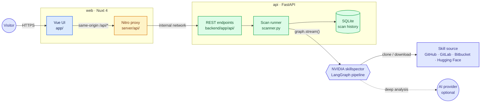

<div align="center">


# Skillspector Web

**Is this skill safe to install?** A self-hosted web app that scans AI agent skills — Claude Code,
Codex, MCP — for prompt injection, data exfiltration and other vulnerabilities before you
install them. Powered by [NVIDIA/skillspector](https://github.com/NVIDIA/skillspector).

[](https://github.com/maelbel/skillspector-web/actions/workflows/ci.yml)
[](https://github.com/maelbel/skillspector-web/releases)
[](./LICENSE)


[Features](#features) · [Quick start](#quick-start) · [Configuration](#configuration) ·
[Deployment](#deployment) · [Architecture](#architecture) · [Security model](#security-model) ·
[Contributing](./CONTRIBUTING.md)

<br>

<picture>
  <source media="(prefers-color-scheme: dark)" srcset="docs/assets/screenshot-home-dark.png">
  
</picture>

</div>

## Features

- **Paste a link, get a verdict.** Scan a repository or a single `SKILL.md` on GitHub, GitLab,
  Bitbucket or Hugging Face and get a 0–100 risk score, a severity and a clear recommendation:
  *Safe to install*, *Review before installing* or *Do not install*.
- **20+ static analyzers.** Prompt injection, data exfiltration, dangerous code, supply chain and
  MCP tool poisoning — every check in skillspector's own pipeline, run as a library, not a CLI
  wrapper.
- **Optional deep analysis with AI.** Bring your own Anthropic, OpenAI or Ollama endpoint per scan
  (the key is used for that scan only and never stored), or use the server's own Claude login with
  no key at all.
- **Findings you can act on.** Filter, sort and group findings by severity or category, each with
  its location, explanation, remediation and code excerpt.
- **Live progress.** Watch each pipeline step and the scanner's log stream while a scan runs.
- **Persistent history.** Every scan is kept in SQLite, with optional automatic retention.
- **Built for self-hosting.** Two containers, an internal-only API, per-IP rate limits, a bounded
  scan queue and a token-gated admin page.

<details>
<summary><b>Scan result page</b></summary>
<br>
<picture>
  <source media="(prefers-color-scheme: dark)" srcset="docs/assets/screenshot-result-dark.png">
  
</picture>
</details>

## Quick start

**Requirements:** Docker with Compose v2.24.4+, and Node.js 22 with pnpm for the setup wizard.

```bash
git clone https://github.com/maelbel/skillspector-web.git
cd skillspector-web
pnpm install
pnpm setup          # interactive: writes backend/.env.local, then starts the stack
```

Open **http://localhost:3005**. Prefer to skip the wizard? `docker compose up --build` works too —
the API then runs with defaults: no sign-in, so keep it on a private network or behind your
reverse proxy's login, or set `SKILLSPECTOR_WEB_AUTH=accounts`.

<details>
<summary><b>Run without Docker</b></summary>
<br>

Requires [uv](https://docs.astral.sh/uv/) and Python 3.12–3.14.

```bash
pnpm install
pnpm setup                                   # choose "Local processes"

cd backend && uv run uvicorn app.main:app --reload            # terminal 1 → :8000
NUXT_API_BASE=http://localhost:8000 pnpm dev                  # terminal 2 → :3000
```

Open **http://localhost:3000**.
</details>

## Configuration

`pnpm setup` writes the common settings to `backend/.env.local`; see
[`backend/.env.example`](./backend/.env.example). Environment variables always win over the file.

### Scan service (`api`)

Every variable is prefixed with `SKILLSPECTOR_WEB_` — for example `SKILLSPECTOR_WEB_AUTH`.

| Variable | Default | Description |
|---|---|---|
| `MODE` | `self_hosted` | Deployment mode: `self_hosted` (one server, as documented here) or `hosted` (Vercel). `hosted` refuses to start until its pieces are built; see the [Hosted version milestone](https://github.com/maelbel/skillspector-web/milestone/1). |
| `AUTH` | *by mode* | Who can use the server: `none` (the `self_hosted` default: no sign-in, every visitor has full access, admin page included) or `accounts` (sign-in required; the first account becomes the admin, users see only their own scans, admins see all and manage the server). Always `accounts` when hosted. |
| `ALLOW_SIGNUP` | *by mode* | With accounts, whether anyone may create one. Off when self-hosted (admins add users from the admin page), on when hosted. |
| `SESSION_DAYS` | `30` | How long a sign-in lasts. |
| `JOB_RUNNER` | *by mode* | How scans run: `in_process` (the `self_hosted` default: tasks inside the API) or `vercel_queues` (the `hosted` default: a durable Vercel Queues topic consumed by a queue-triggered function). |
| `LOG_STORE` | *by mode* | Where live scan logs and step progress go: `memory` (the `self_hosted` default; lost on restart) or `database` (the `hosted` default; the scan database, so logs survive restarts and are shared between instances). |
| `SCAN_EXECUTOR` | *by mode* | Where a scan's fetch and analysis happen: `local` (the `self_hosted` default: inside the API) or `sandbox` (the `hosted` default: a fresh Vercel Sandbox microVM per scan). |
| `SANDBOX_SNAPSHOT_ID` | *unset* | Snapshot sandboxed scans boot from, with skillspector preinstalled. Build it with `uv run python -m app.sandbox_snapshot` (needs Vercel credentials). Required with `SCAN_EXECUTOR=sandbox`. |
| `SANDBOX_VCPUS`<br>`SANDBOX_TIMEOUT_SECONDS` | `2`<br>`240` | vCPUs per scan sandbox, and how long a sandboxed scan may run before it's stopped and reported as timed out. |
| `MAX_CONCURRENT_SCANS` | `2` | Scans running at once. Scans with AI analysis also run one at a time. |
| `MAX_QUEUED_SCANS` | `20` | Running + waiting scans; beyond this, new scans get `503`. |
| `SCAN_RATE_LIMIT`<br>`SCAN_RATE_LIMIT_WINDOW_SECONDS` | `5`<br>`60` | Scans allowed per client IP within the window. |
| `LOGIN_RATE_LIMIT`<br>`LOGIN_RATE_LIMIT_WINDOW_SECONDS` | `10`<br>`300` | Sign-in, first-run setup and sign-up attempts allowed per client IP within the window. |
| `SCAN_RETENTION_DAYS` | *unset* | Retention when the database is first created (unset keeps scans forever). Change it later from the admin page. |
| `DATABASE_URL` | *unset* | A `postgres://` or `postgresql://` URL stores scans in Postgres instead of SQLite. Required in hosted mode. The schema is created and migrated on startup. |
| `DB_PATH` | `data/scans.db` | SQLite file, relative to `backend/`, used when `DATABASE_URL` is unset. |
| `CORS_ORIGINS` | `["http://localhost:3000"]` | Origins allowed to call the API directly. The UI goes through its own proxy, so this rarely matters. |

### Web app (`web`)

| Variable | Default | Description |
|---|---|---|
| `NUXT_API_BASE` | `http://localhost:8000` | Where the Nitro proxy reaches the API (`http://api:8000` in Compose). |
| `NUXT_TRUST_PROXY` | `false` | Set to `true` behind a reverse proxy so rate limits use the client IP it appends to `X-Forwarded-For`. |
| `NUXT_ALLOWED_HOST` | *unset* | Public hostname allowed by the development server (`nuxt dev`) only. |

### AI analysis

Deep analysis is chosen per scan in the form — no server setup is needed for the bring-your-own-key
providers.

| Provider | What the visitor supplies | Where the skill's content is sent |
|---|---|---|
| Claude via this server | nothing | Anthropic, through the server's `claude` CLI login |
| Anthropic | API key | Anthropic, or the base URL provided |
| OpenAI | API key | OpenAI, or any OpenAI-compatible base URL |
| Ollama | base URL | That Ollama server |

To enable the server's Claude login, sign in once — from the admin page, or from a terminal:

```bash
docker exec -it skillspector-api claude auth login
```

The login is stored in the `claude_cli_auth` volume and survives rebuilds. Every visitor's
Claude-backed scans share it — see the [security model](#security-model).

## Deployment

`docker-compose.yml` runs both services as **development servers** (hot reload, bind-mounted
source) — convenient on a workstation, not what you want on the internet. For a real deployment,
add the production overlay, which builds the `production` image targets and keeps data in named
volumes:

```bash
docker compose -f docker-compose.yml -f docker-compose.prod.yml up -d --build
```

- Only `web` is published (port `3005`). `api` is reachable solely on the internal Docker network.
- Scan history lives in the `api_data` volume; the Claude login in `claude_cli_auth`.
- For TLS and a real hostname, put a reverse proxy in front — see
  [docs/REVERSE_PROXY.md](./docs/REVERSE_PROXY.md) for a Traefik example, and remember
  `NUXT_TRUST_PROXY=true`.
- Anyone who can reach the UI can use it; see the [security model](#security-model) before exposing
  it publicly.

## Architecture

Two services. The Nuxt app serves the UI and a same-origin `/api/*` proxy (Nitro), so browsers
never talk to the scan service directly. The FastAPI service imports skillspector as a library and
streams its compiled LangGraph pipeline in a worker thread, recording progress and logs as it goes.



A scan's lifecycle: the form posts to `/api/scan` → the API validates the URL, applies the rate
limit and queue cap, records a `pending` scan and schedules it → the runner streams the pipeline,
updating progress and logs → the result page polls status and logs every two seconds until the
report is ready.

```mermaid
flowchart TD

subgraph group_experience["Web experience"]
  node_home["Scan home<br/>[index.vue]"]
  node_scan_form["Scan form<br/>[ScanForm.vue]"]
  node_result_page["Scan result<br/>[#91;id#93;.vue]"]
  node_scan_status["Status polling<br/>[useScanStatus.ts]"]
  node_scan_logs["Log polling<br/>[useScanLogs.ts]"]
  node_history_page["History page<br/>[history.vue]"]
  node_admin_page["Admin page<br/>[admin.vue]"]
end

subgraph group_proxy["Nitro API proxy"]
  node_health_proxy["Health proxy<br/>[health.get.ts]"]
  node_scan_proxy["Scan proxy<br/>[scan.post.ts]"]
  node_status_proxy["Status proxy<br/>[#91;id#93;.get.ts]"]
  node_logs_proxy["Logs proxy<br/>[logs.get.ts]"]
  node_history_proxy["History proxy<br/>[index.get.ts]"]
  node_delete_proxy["Delete proxy<br/>[index.delete.ts]"]
  node_settings_proxy["Settings proxy<br/>[settings.get.ts]"]
  node_settings_write_proxy["Settings update proxy<br/>[settings.put.ts]"]
  node_claude_start_proxy["Claude login start<br/>[start.post.ts]"]
  node_claude_complete_proxy["Claude login complete<br/>[complete.post.ts]"]
end

subgraph group_service["Scan service"]
  node_fastapi["FastAPI application<br/>[main.py]"]
  node_scan_routes["Scan endpoints<br/>[scan.py]"]
  node_scanner["Skillspector runner<br/>[scanner.py]"]
  node_scan_db[("Scan history store<br/>[db.py]")]
  node_logs_backend["Scan log service<br/>[scan_logs.py]"]
end

subgraph group_admin["History and admin"]
  node_admin_routes["Admin endpoints<br/>[admin.py]"]
  node_claude_login["Claude login flow<br/>[claude_login.py]"]
  node_settings_routes["Settings endpoints<br/>[settings.py]"]
  node_retention["Retention service<br/>[retention.py]"]
end

node_visitor(("Visitor"))
node_skillspector{{"skillspector pipeline"}}
node_llm_provider(("AI provider"))
node_claude_cli(("Claude CLI session"))

node_visitor -->|"opens"| node_home
node_home -->|"presents"| node_scan_form
node_home -->|"lists recent scans"| node_history_proxy
node_scan_form -->|"checks availability"| node_health_proxy
node_scan_form -->|"submits scan"| node_scan_proxy
node_health_proxy -->|"forwards request"| node_fastapi
node_scan_proxy -->|"forwards request"| node_scan_routes
node_scan_routes -->|"starts and reads jobs"| node_scanner
node_scan_routes -->|"reads logs"| node_logs_backend
node_scanner -->|"invokes pipeline"| node_skillspector
node_scanner -->|"reads and writes"| node_scan_db
node_scanner -->|"records logs"| node_logs_backend
node_result_page -->|"tracks scan"| node_scan_status
node_result_page -->|"shows logs"| node_scan_logs
node_scan_status -->|"polls status"| node_status_proxy
node_scan_logs -->|"polls logs"| node_logs_proxy
node_status_proxy -->|"forwards request"| node_scan_routes
node_logs_proxy -->|"forwards request"| node_scan_routes
node_visitor -->|"opens"| node_history_page
node_history_page -->|"loads scans"| node_history_proxy
node_history_page -->|"deletes scan"| node_delete_proxy
node_history_page -->|"shows retention"| node_settings_proxy
node_history_proxy -->|"forwards request"| node_scan_routes
node_delete_proxy -->|"forwards request"| node_scan_routes
node_visitor -->|"opens"| node_admin_page
node_admin_page -->|"loads settings"| node_settings_proxy
node_admin_page -->|"updates settings"| node_settings_write_proxy
node_admin_page -->|"starts login"| node_claude_start_proxy
node_admin_page -->|"completes login"| node_claude_complete_proxy
node_settings_proxy -->|"forwards request"| node_settings_routes
node_settings_write_proxy -->|"forwards request"| node_settings_routes
node_claude_start_proxy -->|"forwards request"| node_admin_routes
node_claude_complete_proxy -->|"forwards request"| node_admin_routes
node_fastapi -->|"registers routes"| node_scan_routes
node_fastapi -->|"registers routes"| node_admin_routes
node_fastapi -->|"registers routes"| node_settings_routes
node_fastapi -->|"starts service"| node_retention
node_settings_routes -->|"updates policy"| node_retention
node_retention -->|"deletes expired scans"| node_scan_db
node_admin_routes -->|"runs login"| node_claude_login
node_claude_login -.->|"authenticates"| node_claude_cli
node_fastapi -.->|"checks login"| node_claude_cli
node_scanner -.->|"uses optionally"| node_llm_provider
node_scanner -.->|"uses optionally"| node_claude_cli

click node_home "https://github.com/maelbel/skillspector-web/blob/main/app/pages/index.vue"
click node_scan_form "https://github.com/maelbel/skillspector-web/blob/main/app/components/ScanForm.vue"
click node_result_page "https://github.com/maelbel/skillspector-web/blob/main/app/pages/scan/%5Bid%5D.vue"
click node_scan_status "https://github.com/maelbel/skillspector-web/blob/main/app/composables/useScanStatus.ts"
click node_scan_logs "https://github.com/maelbel/skillspector-web/blob/main/app/composables/useScanLogs.ts"
click node_history_page "https://github.com/maelbel/skillspector-web/blob/main/app/pages/history.vue"
click node_admin_page "https://github.com/maelbel/skillspector-web/blob/main/app/pages/admin.vue"
click node_health_proxy "https://github.com/maelbel/skillspector-web/blob/main/server/api/health.get.ts"
click node_scan_proxy "https://github.com/maelbel/skillspector-web/blob/main/server/api/scan.post.ts"
click node_status_proxy "https://github.com/maelbel/skillspector-web/blob/main/server/api/scan/%5Bid%5D.get.ts"
click node_logs_proxy "https://github.com/maelbel/skillspector-web/blob/main/server/api/scan/%5Bid%5D/logs.get.ts"
click node_history_proxy "https://github.com/maelbel/skillspector-web/blob/main/server/api/scan/index.get.ts"
click node_delete_proxy "https://github.com/maelbel/skillspector-web/blob/main/server/api/scan/%5Bid%5D/index.delete.ts"
click node_settings_proxy "https://github.com/maelbel/skillspector-web/blob/main/server/api/settings.get.ts"
click node_settings_write_proxy "https://github.com/maelbel/skillspector-web/blob/main/server/api/settings.put.ts"
click node_claude_start_proxy "https://github.com/maelbel/skillspector-web/blob/main/server/api/admin/claude-login/start.post.ts"
click node_claude_complete_proxy "https://github.com/maelbel/skillspector-web/blob/main/server/api/admin/claude-login/complete.post.ts"
click node_fastapi "https://github.com/maelbel/skillspector-web/blob/main/backend/app/main.py"
click node_scan_routes "https://github.com/maelbel/skillspector-web/blob/main/backend/app/api/routes/scan.py"
click node_scanner "https://github.com/maelbel/skillspector-web/blob/main/backend/app/scanner.py"
click node_scan_db "https://github.com/maelbel/skillspector-web/blob/main/backend/app/db.py"
click node_logs_backend "https://github.com/maelbel/skillspector-web/blob/main/backend/app/scan_logs.py"
click node_admin_routes "https://github.com/maelbel/skillspector-web/blob/main/backend/app/api/routes/admin.py"
click node_claude_login "https://github.com/maelbel/skillspector-web/blob/main/backend/app/claude_login.py"
click node_settings_routes "https://github.com/maelbel/skillspector-web/blob/main/backend/app/api/routes/settings.py"
click node_retention "https://github.com/maelbel/skillspector-web/blob/main/backend/app/retention.py"

classDef toneNeutral fill:#f8fafc,stroke:#334155,stroke-width:1.5px,color:#0f172a
classDef toneBlue fill:#dbeafe,stroke:#2563eb,stroke-width:1.5px,color:#172554
classDef toneAmber fill:#fef3c7,stroke:#d97706,stroke-width:1.5px,color:#78350f
classDef toneMint fill:#dcfce7,stroke:#16a34a,stroke-width:1.5px,color:#14532d
classDef toneRose fill:#ffe4e6,stroke:#e11d48,stroke-width:1.5px,color:#881337
classDef toneIndigo fill:#e0e7ff,stroke:#4f46e5,stroke-width:1.5px,color:#312e81
classDef toneTeal fill:#ccfbf1,stroke:#0f766e,stroke-width:1.5px,color:#134e4a
class node_home,node_scan_form,node_result_page,node_scan_status,node_scan_logs,node_history_page,node_admin_page toneBlue
class node_health_proxy,node_scan_proxy,node_status_proxy,node_logs_proxy,node_history_proxy,node_delete_proxy,node_settings_proxy,node_settings_write_proxy,node_claude_start_proxy,node_claude_complete_proxy toneAmber
class node_fastapi,node_scan_routes,node_scanner,node_scan_db,node_logs_backend toneMint
class node_admin_routes,node_claude_login,node_settings_routes,node_retention toneRose
class node_visitor,node_skillspector,node_llm_provider,node_claude_cli toneIndigo
```

<details>
<summary><b>Full component map</b> — every page, proxy route and backend module</summary>
<br>



Each node links to its source file.
</details>

### Repository layout

```text
app/                    Vue UI — pages, components, composables, client utils
server/api/             Nitro proxy routes, one per backend endpoint
shared/                 Types and URL helpers shared by the UI and the proxy
backend/app/            FastAPI service
  api/routes/           scan, settings and admin endpoints
  scanner.py            job queue and skillspector pipeline runner
  db.py                 SQLite scan history and settings
  scan_logs.py          per-scan log capture and progress
  retention.py          hourly sweep of expired scans
  claude_login.py       server-side `claude auth login` flow and status probe
backend/tests/          pytest suite
test/                   Vitest suite
docs/                   deployment guides and README assets
scripts/setup.mjs       the `pnpm setup` wizard
```

The scan service's endpoints are documented in [backend/README.md](./backend/README.md).

## Security model

Skillspector Web is designed for a trusted audience — yourself, a team, a homelab. What is and
isn't protected:

- **Authentication is your choice.** With `AUTH=none` (the self-hosted default) there's no
  sign-in: anyone who can reach the UI can run, read and delete every scan and use the admin page,
  including the server's Claude login. Keep it on a private network or behind your reverse proxy's
  authentication (for example Authentik or Authelia forward-auth). With `AUTH=accounts`:
  - Every page needs a sign-in. Scans belong to the user who ran them, and a user can't see,
    open or delete anyone else's (the API answers `404`). Admins see every scan, including ones
    from before accounts were turned on, and manage users, retention and the Claude login.
  - Passwords are hashed with scrypt. Sessions are random tokens stored only as SHA-256 hashes,
    kept in an `httpOnly`, `SameSite=Lax` cookie that page scripts can't read, and expire after
    `SESSION_DAYS`.
  - Sign-in and password-reset attempts are rate-limited per client IP.
  - **Forgotten passwords:** there's no email on a self-hosted server, so an admin creates a
    one-time reset link from the admin page (valid 24 hours, stored only as a hash, and cancelled
    by a newer link) and passes it on. Using it signs the person out everywhere else. Anyone
    signed in can change their password from the Account page. An admin locked out of their own
    account can print a link on the server:
    `docker exec skillspector-api uv run python -m app.auth.reset_link you@example.com`.
- **The server's Claude login is shared.** When it's signed in, every visitor can run
  Claude-backed scans on it.
- **Scan targets are constrained** by skillspector: https only, an allowlist of Git and download
  hosts, private and internal addresses refused, no redirects followed, and size limits on clones,
  archives and downloads.
- **Where scans run.** Self-hosted, targets are fetched and analysed inside the API process. With
  `SCAN_EXECUTOR=sandbox` (the hosted default) each scan runs in its own short-lived Vercel Sandbox
  microVM instead: booted from a snapshot, 2 vCPUs, stopped after `SANDBOX_TIMEOUT_SECONDS`, outbound
  traffic limited to the code hosts above with private address ranges blocked, and nothing from
  the app's environment passed in.
- **Custom AI base URLs are not restricted.** A visitor-supplied Base URL makes the server send
  requests to that address — another reason not to expose the app without authentication.
- **API keys** are held in memory only for the duration of the scan that uses them; they are never
  written to the database, logs or browser storage.

Found a vulnerability? Please report it privately — see [SECURITY.md](./SECURITY.md).

## Limitations

- Scans run inside the API process: restarting it fails in-flight scans (they're marked as
  interrupted on startup), and it can't run as more than one replica.
- Live logs are kept in memory for the 50 most recent scans; the report itself is persisted.
- Only URLs can be scanned — there's no file upload, and folder (`/tree/`) links aren't supported;
  link the repository or a `SKILL.md` file instead.

## License

[MIT](./LICENSE) for this project's code. It uses
[NVIDIA/skillspector](https://github.com/NVIDIA/skillspector) (Apache-2.0) as a dependency,
installed at build time rather than vendored, so its own license applies to it.
