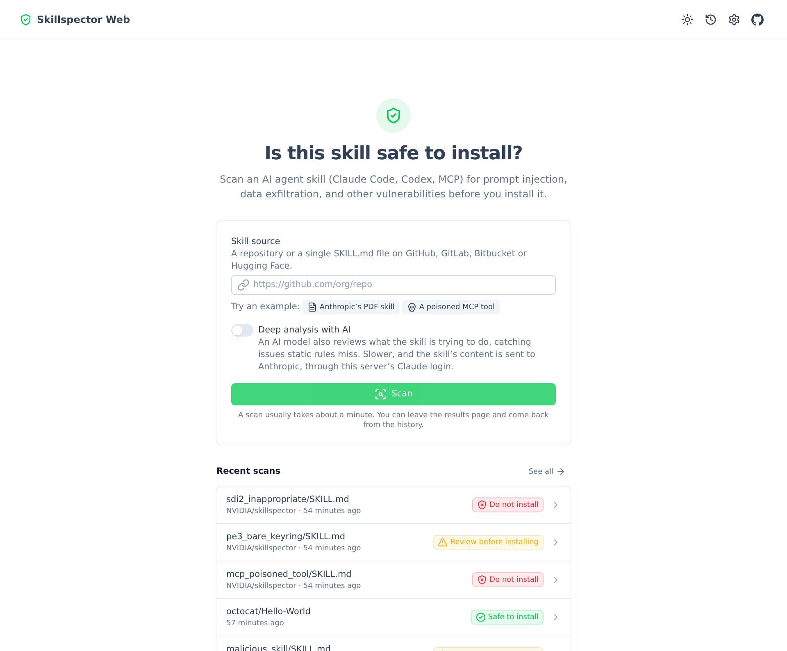
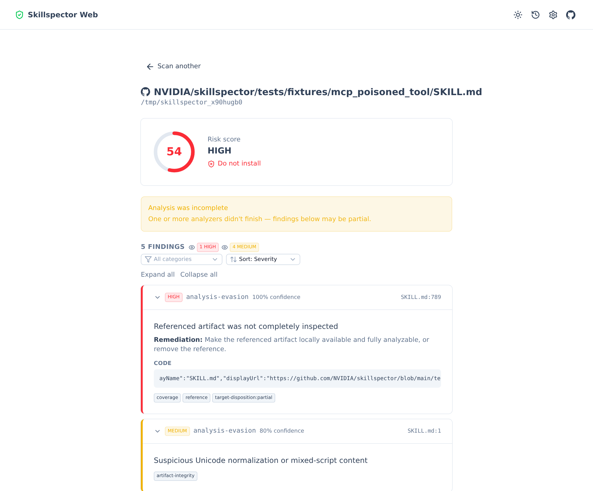
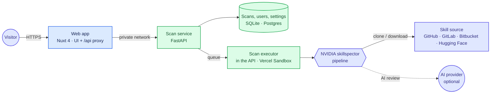

<div align="center">


# Skillspector Web

**Know whether an AI agent skill is safe before you install it.**

Scan Claude Code, Codex and MCP skills for prompt injection, data exfiltration, dangerous code and
supply-chain risks, and get a clear verdict in seconds. A web interface for
[NVIDIA/skillspector](https://github.com/NVIDIA/skillspector), which you can run on your own server
or deploy to Vercel.

[](https://github.com/maelbel/skillspector-web/actions/workflows/ci.yml)
[](https://github.com/maelbel/skillspector-web/releases)
[](./LICENSE)


[Features](#features) · [Quick start](#quick-start) · [Deployment](#deployment) ·
[How it works](#how-it-works) · [Security](#security) · [Documentation](#documentation)

<br>

<picture>
  <source media="(prefers-color-scheme: dark)" srcset="docs/assets/screenshot-home-dark.png">
  
</picture>

</div>

## Features

**Scanning**
- **Paste a link, get a verdict.** Scan a repository, one folder in it, or a single skill file on
  GitHub, GitLab, Bitbucket or Hugging Face. You get a 0–100 risk score, a severity, and one of three
  recommendations: *Safe to install*, *Review before installing* or *Do not install*.
- **See what changed.** Rescan a skill from its result or the history: findings are marked new,
  fixed or unchanged since its previous scan, with the change in score and verdict, and each
  target's scans line up as a timeline.
- **Or upload it.** Drop a `.zip` of a skill, or its `SKILL.md`, on the scan form to scan one you
  haven't published. The file is kept only until it's scanned.
- **20+ static analyzers.** Prompt injection, data exfiltration, dangerous code, supply chain and
  MCP tool poisoning: skillspector's full pipeline, run as a library rather than a CLI wrapper.
- **Optional AI review.** Add a deeper semantic analysis with your own Claude, OpenAI or Ollama
  endpoint, or with a Claude key saved to your account.
- **MCP servers too.** Enter a server's name from the [MCP Registry](https://registry.modelcontextprotocol.io)
  (e.g. `io.github.github/github-mcp-server`) to check its entry's posture: packages pinned to
  exact versions with valid hashes, a source repository, an active status, and HTTPS endpoints.

**Results**
- **Findings you can act on.** Filter, sort and group by severity or category. Each finding shows
  its location, an explanation, a code excerpt and how to fix it.
- **Live progress.** Follow each pipeline step and the scanner's log while a scan runs.
- **History.** Every scan is kept, with an optional retention period.

**Operations**
- **Accounts, optional when self-hosted.** Scans are private to their owner. Admins get a
  backoffice with users, an activity log and server settings.
- **Abuse and cost controls.** Rate limits, a bounded queue, per-user quotas and a switch that
  pauses new scans, all adjustable without a redeploy.
- **Two ways to run it.** Docker Compose on your own server, or one Vercel project where every scan
  runs in its own isolated microVM.

<details>
<summary><b>Scan result page</b></summary>
<br>
<picture>
  <source media="(prefers-color-scheme: dark)" srcset="docs/assets/screenshot-result-dark.png">
  
</picture>
</details>

## Quick start

**Requirements:** Docker with Compose v2.24.4+, and Node.js 22 with pnpm for the setup wizard.

```bash
git clone https://github.com/maelbel/skillspector-web.git
cd skillspector-web
pnpm install
pnpm setup          # interactive: writes backend/.env.local, then starts the stack
```

Open **http://localhost:3005** and paste a skill's link.

> [!IMPORTANT]
> Started without the wizard (`docker compose up --build`), the app runs with no sign-in: anyone
> who can reach it has full access. Keep it on a private network or behind your reverse proxy's
> login, or set `SKILLSPECTOR_WEB_AUTH=accounts`.

<details>
<summary><b>Run without Docker</b></summary>
<br>

Requires [uv](https://docs.astral.sh/uv/) and Python 3.12–3.14.

```bash
pnpm install
pnpm setup                                   # choose "Local processes"

cd backend && uv run uvicorn app.main:app --reload            # terminal 1 → :8000
NUXT_API_BASE=http://localhost:8000 pnpm dev                  # terminal 2 → :3000
```

Open **http://localhost:3000**.
</details>

## Deployment

|  | Self-hosted | Hosted on Vercel |
|---|---|---|
| **Best for** | yourself, a team, a homelab | a public service |
| **Runs on** | Docker Compose: two containers | one Vercel project with two services |
| **Data** | SQLite in a Docker volume | Postgres (Neon), a separate database for previews |
| **Where scans run** | inside the API container | a fresh Vercel Sandbox microVM per scan |
| **Sign-in** | optional | always on |
| **AI review** | any provider, or the server's Claude login | each user's own Claude key |
| **Guide** | [below](#self-hosted) | [docs/VERCEL.md](./docs/VERCEL.md) |

### Self-hosted

`docker-compose.yml` runs development servers with hot reload. For a real deployment, add the
production overlay, which builds the production images and keeps data in named volumes:

```bash
docker compose -f docker-compose.yml -f docker-compose.prod.yml up -d --build
```

- **Ports:** only the web app is published (port `3005`). The API is reachable on the internal
  Docker network only.
- **Data:** scan history lives in the `api_data` volume, and the server's Claude login in
  `claude_cli_auth`.
- **TLS:** put a reverse proxy in front, and set `NUXT_TRUST_PROXY=true`.
  [docs/REVERSE_PROXY.md](./docs/REVERSE_PROXY.md) has a Traefik example.

### Hosted on Vercel

`vercel.ts` deploys the web app and the API as one project, and only the web app is public:
- Scans go through Vercel Queues and run in Vercel Sandbox microVMs.
- BotID and quotas protect scan submissions.
- A daily cron job applies retention.

[docs/VERCEL.md](./docs/VERCEL.md) walks through the first deployment and every environment
variable.

### Configuration

Everything is set through environment variables, prefixed `SKILLSPECTOR_WEB_`. The ones you're most
likely to change:

| Variable | Purpose |
|---|---|
| `AUTH` | `none` (no sign-in, the self-hosted default) or `accounts` |
| `SMTP_HOST`, `MAIL_FROM`, `PUBLIC_URL` | password reset emails |
| `SECRET_KEY` | lets users save their Claude key, encrypted |
| `SCAN_RETENTION_DAYS` | delete scans after this many days |
| `DATABASE_URL` | use Postgres instead of SQLite |

[docs/CONFIGURATION.md](./docs/CONFIGURATION.md) lists every setting, and how to set up AI review.

## How it works

The Nuxt app serves the UI and a same-origin `/api/*` proxy, so browsers never call the scan
service directly. The FastAPI service runs skillspector's pipeline and records each scan's
progress, logs and report.



[docs/ARCHITECTURE.md](./docs/ARCHITECTURE.md) covers both deployment modes, a scan's lifecycle and
the repository layout.

## Security

Self-hosted, Skillspector Web is built for a trusted audience: yourself, a team, a homelab.
- **Sign-in:** turn on `AUTH=accounts` before exposing it beyond that.
- **Scan targets:** https only, from an allowlist of code hosts (and the MCP Registry, for MCP
  servers), with private addresses refused and size limits on every download.
- **Passwords and sessions:** passwords are hashed with scrypt, and session tokens are stored only
  as hashes.
- **API keys:** they never appear in responses, logs or browser storage.

The hosted version adds isolation:
- Every scan runs in a throwaway microVM that can only reach the code hosts and the MCP Registry.
- A user's Claude key is added to requests by the sandbox firewall and never enters the VM.

[docs/SECURITY_MODEL.md](./docs/SECURITY_MODEL.md) describes what is and isn't protected. To report
a vulnerability, see [SECURITY.md](./SECURITY.md).

## Limitations

- Uploads are a `.zip` or a single `.md` file, up to 25 MB. Folder (`/tree/`) links work on GitHub,
  GitLab and Hugging Face, not on Bitbucket. From a Hugging Face folder, large files stored with LFS (such
  as model weights) aren't scanned.
- Self-hosted:
  - Scans run inside the API process, so a restart fails the scans in progress, and the API
    can't run as more than one replica.
  - Live logs are kept in memory for the 50 most recent scans. Reports are always saved.

## Documentation

| Guide | What's in it |
|---|---|
| [Configuration](./docs/CONFIGURATION.md) | every setting, and AI review providers |
| [Architecture](./docs/ARCHITECTURE.md) | components, deployment modes, repository layout |
| [Security model](./docs/SECURITY_MODEL.md) | authentication, isolation, keys and abuse limits |
| [Deploying to Vercel](./docs/VERCEL.md) | the hosted version, step by step |
| [Vercel Firewall rules](./docs/VERCEL_FIREWALL.md) | edge rate limits for the hosted version |
| [Reverse proxy](./docs/REVERSE_PROXY.md) | TLS and a hostname for a self-hosted server |
| [Scan service API](./backend/README.md) | endpoints and behaviour of the FastAPI service |
| [Contributing](./CONTRIBUTING.md) | development setup and checks |

## License

[MIT](./LICENSE) for this project's code. It uses
[NVIDIA/skillspector](https://github.com/NVIDIA/skillspector) (Apache-2.0) as a dependency,
installed at build time rather than vendored, so its own license applies to it.
