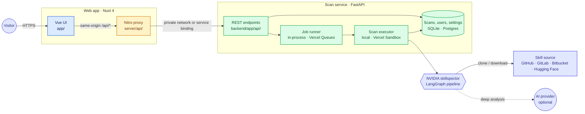

# Architecture

Skillspector Web has two parts. The **web app** (Nuxt 4) serves the UI and a same-origin `/api/*`
proxy (Nitro), so browsers never talk to the scan service directly. The **scan service**
(FastAPI) imports [skillspector](https://github.com/NVIDIA/skillspector) as a library, runs its
LangGraph pipeline, and records each scan's progress, logs and report.

The same code serves two deployment modes (`SKILLSPECTOR_WEB_MODE`). Each piece that depends on
where the app runs has one implementation per mode.

| Piece | `self_hosted` (default) | `hosted` (Vercel) |
|---|---|---|
| Storage | SQLite file | Postgres |
| Job runner | asyncio tasks in the API process | Vercel Queues topic, consumed by a queue-triggered function |
| Scan executor | inside the API process | a fresh Vercel Sandbox microVM per scan |
| Logs and progress | in memory | in the database |
| Rate limits | in memory | in the database |
| Retention sweep | hourly background task | daily Vercel Cron job |
| Sign-in | off or on (`AUTH`) | always on |

## Overview



## A scan's lifecycle

1. The form posts to `/api/scan`. On the hosted version, BotID screens the request first.
2. The API checks the request:
   - it validates the target and rewrites a code host's file view (`/blob/`) to the raw file
   - it applies the pause switch, the rate limits, the queue cap and the user's quotas
   - it records a `pending` scan and hands it to the job runner
3. The runner starts the scan:
   - **Self-hosted**, an asyncio task runs it in a worker thread.
   - **Hosted**, the scan id is published to the `scans` queue topic, and the subscriber function
     boots a sandbox from the snapshot and runs `sandbox_runner.py` in it. The sandbox's network
     only reaches the code hosts and the MCP Registry, plus Anthropic when AI review is on.
4. As the pipeline runs, each finished step and log line is recorded against the scan. The result
   page polls status and logs every two seconds until the report is stored.

## Repository layout

```text
app/                      Vue UI: pages, components, composables, client utils
server/api/               Nitro proxy routes, one per backend endpoint
server/utils/             proxy helpers: backend calls, sessions, client IP, BotID
shared/                   types and URL helpers shared by the UI and the proxy
backend/app/
  main.py                 FastAPI app and startup checks
  api/routes/             scan, account, auth, users, backoffice, settings, admin, internal
  auth/                   accounts, sessions, password hashing and reset links
  core/                   settings (config.py) and deployment modes (mode.py)
  storage/                SQLite and Postgres stores with versioned migrations
  jobs/                   job runners: in-process, Vercel Queues, and the queue subscriber
  scanner.py              the skillspector pipeline runner
  sandbox_executor.py     runs a scan in a Vercel Sandbox (with sandbox_runner.py inside)
  sandbox_snapshot.py     builds the snapshot sandboxed scans boot from
  sandbox_snapshot_record.py  the snapshot's ID and the pin it was built from (written by CI)
  quotas.py               per-user scan quotas and the pause switch
  rate_limit.py           sliding-window rate limits
  retention.py            deletes scans past the retention period
  claude_key.py           users' saved Claude keys (encrypted by secrets_box.py)
  targets.py              rewrites code host file links to the raw file
backend/tests/            pytest suite
test/                     Vitest suite
docs/                     guides and README assets
scripts/setup.mjs         the `pnpm setup` wizard
action.yml, action/       the GitHub Action that scans a pull request's skills
vercel.ts                 the hosted deployment: services, routing and cron
```

The scan service's endpoints and behaviour are documented in
[backend/README.md](../backend/README.md).
